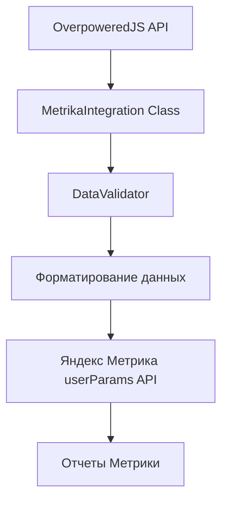

# Подход к интеграции OverpoweredJS с Яндекс Метрикой

## 📋 Определенный подход

На основе изучения документации и анализа предоставленных данных определен следующий подход для интеграции OverpoweredJS с Яндекс Метрикой:

## 🔧 Техническое решение

### 1. Архитектура интеграции



### 2. Основные компоненты

**MetrikaIntegration** - Основной класс интеграции
- Сбор данных через OverpoweredJS API
- Форматирование для Яндекс Метрики
- Безопасная передача данных
- Поддержка целей и событий

**DataValidator** - Утилиты валидации
- Проверка размера и структуры данных
- Фильтрация чувствительной информации
- Очистка недопустимых символов
- Соответствие требованиям Метрики

## 📊 Передаваемые параметры

### Из OverpoweredJS в Яндекс Метрику:

```javascript
// Исходные данные OverpoweredJS
{
  "clusterUUID": "740-VJK-PPQ-1NZ",
  "botScore": 3,
  "browserTraits": {
    "type": "chromium",
    "hasCanvasNoise": false,
    "isIncognito": false,
    "isWebView": false,
    "isAndroidWebView": false,
    "possibleCountryCodes": ["RU"],
    "isFakeUserAgent": false,
    "isRootedDevice": false,
    "isAntiDetect": false
  },
  "lastSeen": 135,
  "debug": {
    "hash": "f1d41940b98f...",
    "performance": "35.00ms"
  }
}

// Преобразованные данные для Метрики
{
  "overpowered_cluster_uuid": "740-VJK-PPQ-1NZ",
  "overpowered_bot_score": 3,
  "browser_type": "chromium",
  "browser_has_canvas_noise": false,
  "browser_is_incognito": false,
  "browser_is_webview": false,
  "browser_country_codes": "RU",
  "browser_fake_user_agent": false,
  "browser_anti_detect": false,
  "overpowered_performance": "35.00ms"
}
```

## 🚀 Способы передачи данных

### 1. Автоматическая передача при загрузке страницы
```javascript
const integration = new MetrikaIntegration('COUNTER_ID', {
    autoSend: true
});
```

### 2. Ручная передача данных
```javascript
const result = await integration.collectAndSend();
```

### 3. Передача через цели Метрики
```javascript
integration.sendGoal('browser_analysis', additionalParams);
```

### 4. Передача при инициализации счетчика
```javascript
ym('COUNTER_ID', 'init', {
    params: browserParams,
    clickmap: true,
    trackLinks: true
});
```

## 🔒 Безопасность и соответствие требованиям

### Фильтрация данных:
- Удаление токенов авторизации
- Маскирование хешей отладки
- Проверка на персональные данные
- Соответствие политике конфиденциальности

### Валидация:
- Максимальный размер: 8KB
- Максимум параметров: 50
- Очистка недопустимых символов
- Проверка зарезервированных ключей

## 📈 Варианты анализа данных

### В интерфейсе Яндекс Метрики:

1. **Параметры посетителей** - основной отчет с переданными данными
2. **Цели** - события браузерного анализа
3. **Конструктор отчетов** - кастомные отчеты по параметрам
4. **Сегментация** - фильтрация по типам браузеров и характеристикам

### Примеры сегментов:
- Пользователи с высоким bot_score (>5)
- Браузеры с анти-детект функциями
- Мобильные WebView приложения
- Пользователи в режиме инкогнито

## 🎯 Рекомендуемые сценарии использования

### 1. Базовая аналитика браузеров
```javascript
// Простая передача параметров для всех посетителей
const integration = new MetrikaIntegration('COUNTER_ID');
```

### 2. Детекция ботов и подозрительной активности
```javascript
// Отправка цели при высоком bot_score
if (data.botScore > 5) {
    integration.sendGoal('suspicious_activity', {
        bot_score: data.botScore,
        anti_detect: data.browserTraits.isAntiDetect
    });
}
```

### 3. Анализ мобильного трафика
```javascript
// Специальная обработка мобильных устройств
if (data.browserTraits.isAndroidWebView) {
    integration.sendGoal('mobile_webview_user', {
        rooted_device: data.browserTraits.isRootedDevice
    });
}
```

### 4. A/B тестирование безопасности
```javascript
// Разные стратегии для разных типов пользователей
const userSegment = data.botScore > 5 ? 'high_risk' : 'normal';
integration.sendGoal('user_segmentation', { segment: userSegment });
```

## ⚡ Производительность

### Оптимизации:
- Асинхронный сбор данных
- Кеширование результатов анализа
- Пакетная отправка (планируется)
- Ленивая инициализация

### Мониторинг:
- Время анализа OverpoweredJS
- Успешность передачи в Метрику
- Размер передаваемых данных

## 🔧 Настройка и кастомизация

### Гибкие параметры:
```javascript
const options = {
    autoSend: true,              // Автоотправка
    debug: false,                // Отладка
    filterSensitiveData: true,   // Фильтрация
    retryAttempts: 3,           // Повторы при ошибке
    customMapping: {            // Кастомные имена параметров
        'botScore': 'security_score',
        'clusterUUID': 'fingerprint_id'
    }
};
```

## 📋 Следующие шаги

1. **Тестирование** с реальным OverpoweredJS API
2. **Оптимизация** производительности
3. **Расширение** функциональности (пакетная отправка, кеширование)
4. **Мониторинг** и логирование
5. **Документация** для конечных пользователей

## ✅ Преимущества подхода

- **Модульность** - легко интегрируется в существующие проекты
- **Безопасность** - автоматическая фильтрация чувствительных данных
- **Гибкость** - множество способов передачи и настройки
- **Совместимость** - работает с любыми счетчиками Яндекс Метрики
- **Отладка** - подробное логирование для разработки
- **Производительность** - асинхронная работа без блокировки UI

Этот подход обеспечивает надежную и безопасную интеграцию OverpoweredJS с Яндекс Метрикой для детального анализа характеристик браузеров посетителей.
