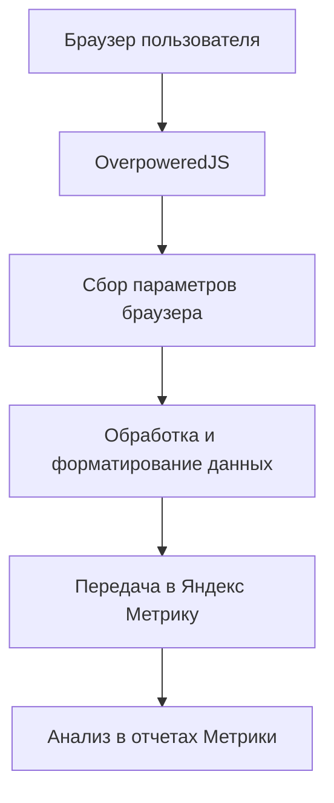

# Metrika Score API v2

## Описание проекта

Проект для интеграции системы анализа параметров браузера OverpoweredJS с Яндекс Метрикой. Позволяет собирать детальную информацию о браузере пользователя и передавать её в систему веб-аналитики для дальнейшего анализа.

## Архитектура



## Основные компоненты

### 1. OverpoweredJS Integration
- Сбор параметров браузера и устройства
- Определение характеристик браузера
- Анализ поведенческих паттернов

### 2. Yandex Metrica Integration
- Передача параметров через API userParams/params
- Интеграция с целями и событиями
- Настройка передачи данных при инициализации

### 3. Data Processing
- Форматирование данных для Метрики
- Фильтрация и валидация параметров
- Обработка ошибок

## Собираемые параметры

### Browser Traits
- `type`: Тип браузера (chromium, firefox, etc.)
- `hasCanvasNoise`: Наличие шума в Canvas
- `isIncognito`: Режим инкогнито
- `isWebView`: WebView окружение
- `isAndroidWebView`: Android WebView
- `possibleCountryCodes`: Возможные коды стран
- `isFakeUserAgent`: Поддельный User-Agent
- `isRootedDevice`: Устройство с root
- `isAntiDetect`: Анти-детект браузер

### Security & Performance
- `clusterUUID`: Уникальный идентификатор кластера
- `botScore`: Оценка вероятности бота (0-10)
- `lastSeen`: Время последней активности
- `authToken`: Токен авторизации
- `debug.hash`: Хеш для отладки
- `debug.performance`: Время выполнения анализа

## Технические требования

- Современный браузер с поддержкой ES6+
- Доступ к OverpoweredJS API
- Настроенный счетчик Яндекс Метрики
- HTTPS соединение (рекомендуется)

## Принципы разработки

- **SOLID**: Соблюдение принципов объектно-ориентированного программирования
- **KISS**: Простота и понятность кода
- **DRY**: Избежание дублирования кода
- **Модульность**: Разделение функциональности на отдельные модули
- **Тестируемость**: Возможность unit-тестирования компонентов

## Структура проекта

```
metrika-score-api2/
├── docs/
│   ├── project.md          # Документация проекта
│   ├── changelog.md        # История изменений
│   └── tasktracker.md      # Трекер задач
├── src/
│   ├── core/               # Основная логика
│   ├── integrations/       # Интеграции с внешними сервисами
│   └── utils/              # Вспомогательные функции
└── examples/               # Примеры использования
```

## Создан: 2025-08-15
## Версия: 1.0.0
